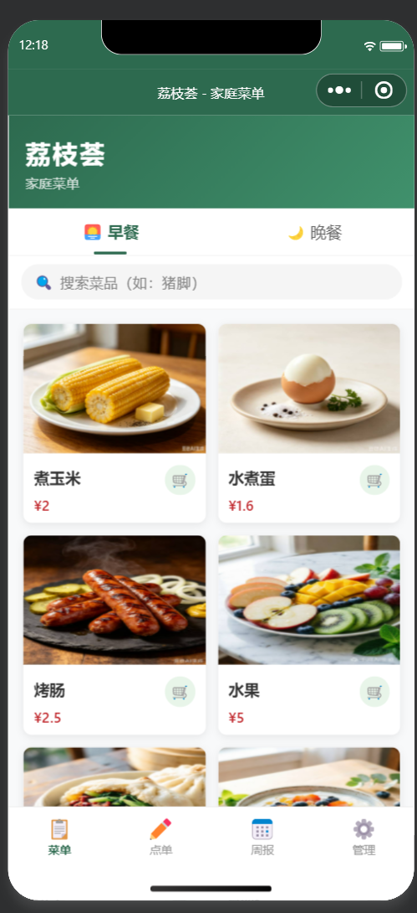
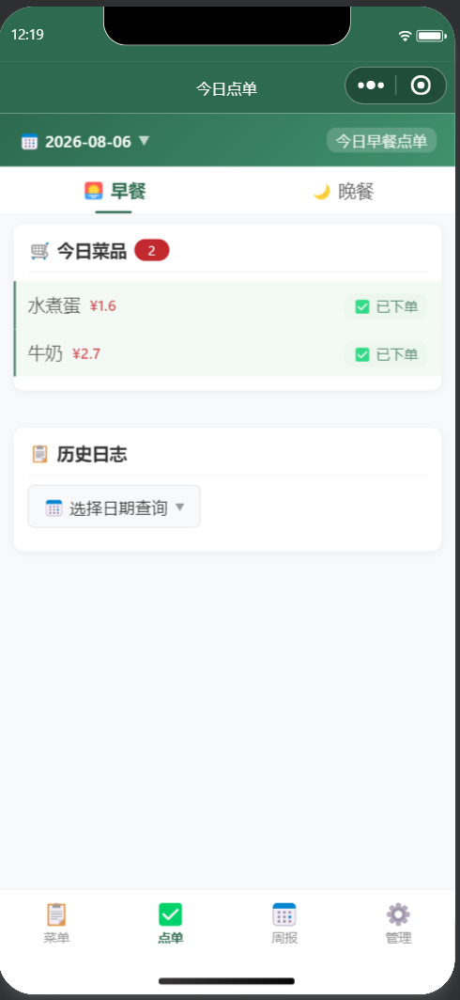
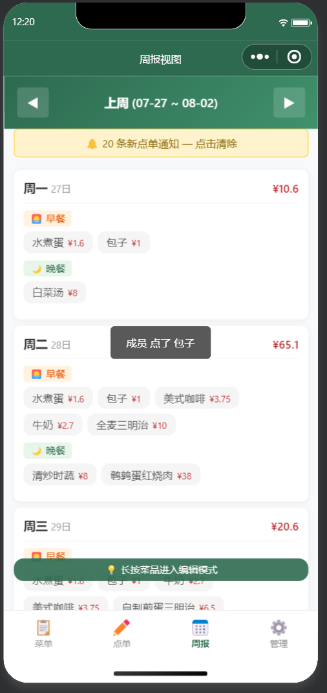
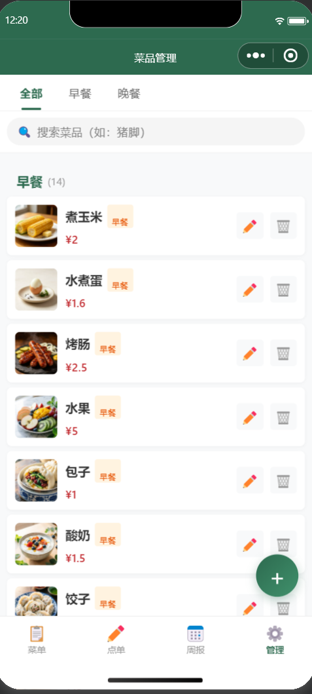
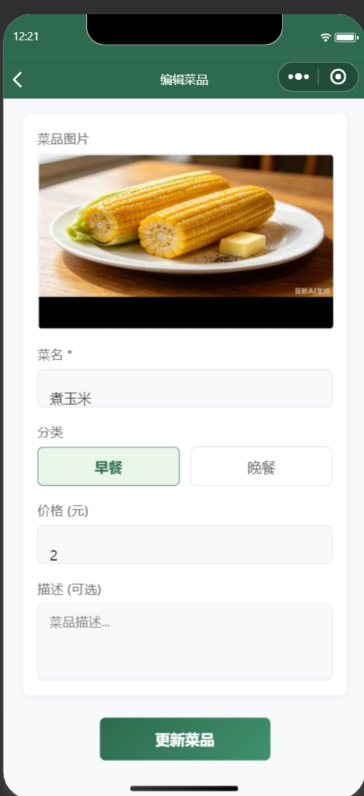
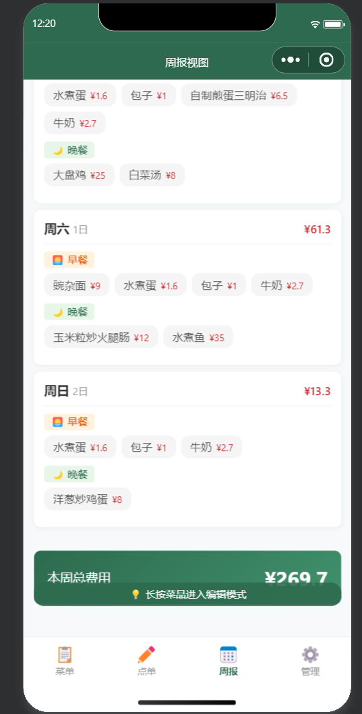
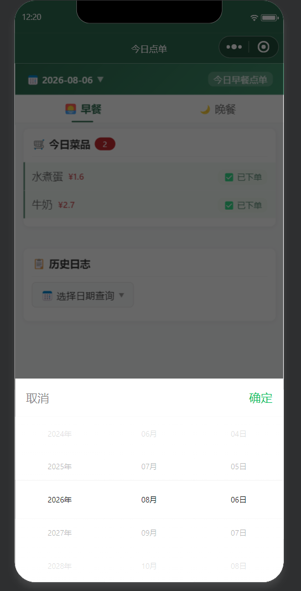

# 荔枝荟 · 家庭菜谱点单小程序

一个基于 **微信小程序原生开发 + 微信云开发** 的家庭菜谱点单系统。家庭成员可以浏览菜单、在线点单、管理菜品，并自动生成每周消费周报，解决"今天吃什么"的家庭决策问题。

## 📱 界面预览

| 菜单浏览 | 在线点单 | 周报统计 |
| :---: | :---: | :---: |
|  |  |  |
| 早餐 / 晚餐智能分组 + 同义词搜索 | 按日期点单，已下单状态实时跟踪 | 按日聚合明细，自动汇总周消费 |

| 菜品管理 | 菜品编辑 | 点单通知 |
| :---: | :---: | :---: |
|  |  |  |
| 分类筛选 + 搜索，编辑 / 删除入口 | 图片上传、分类 / 价格 / 描述设置 | 新点单横幅提醒，创建者实时掌握 |

<p align="center"></p>
<p align="center">📅 历史日志：按日期查询任意一天的点单记录</p>

## ✨ 功能特色

### 🍽️ 菜单浏览（首页）
- 菜品按 **早餐 / 晚餐·素菜 / 晚餐·荤菜·炖菜 / 晚餐·荤菜·炒菜** 智能分组展示
- 支持关键词搜索，内置 **食材同义词词典**（如搜索"番茄"可命中"西红柿"）
- 菜品支持图片、价格、描述展示

### 🛒 在线点单
- 按早餐 / 晚餐分类选菜，实时计算订单金额
- 订单写入云端，多设备实时共享
- 点单通知写入云端，创建者可及时查看

### 📊 周报统计
- 按周汇总家庭点单数据，展示每日明细与周消费总额
- 云端聚合计算，支持订单删除与跨设备同步

### ⚙️ 菜品管理
- 创建者可新增 / 编辑 / 删除菜品（含图片上传）
- 软删除机制，删除状态多端同步
- 首次使用自动初始化默认菜品

### ☁️ 本地优先 + 云端双向同步
- 启动时自动拉取云端数据并与本地合并（并集策略）
- 本地独有菜品自动补传云端，删除状态双向同步
- 云开发不可用时自动降级为纯本地存储模式，保证可用性

## 🛠️ 技术栈

| 类别 | 技术 |
|------|------|
| 前端 | 微信小程序原生框架（WXML / WXSS / JavaScript） |
| 后端 | 微信云开发（云数据库 + 云函数） |
| 数据存储 | 云数据库（dishes / orders / notifications 集合）+ 本地 Storage 双写 |
| UI | 自定义 TabBar，纯手写样式，无第三方组件库 |

## 📁 项目结构

```
lizhi-hui/
├── miniprogram/                  # 小程序前端
│   ├── pages/
│   │   ├── index/                # 菜单页（首页）
│   │   ├── order/                # 点单页
│   │   ├── weekly/               # 周报页
│   │   ├── dish-manage/          # 菜品管理页
│   │   └── dish-edit/            # 菜品编辑页
│   ├── custom-tab-bar/           # 自定义底部导航栏
│   ├── utils/                    # 工具函数
│   ├── app.js                    # 全局逻辑（云初始化、数据同步、搜索分组算法）
│   ├── app.json                  # 全局配置
│   └── app.wxss                  # 全局样式
├── cloudfunctions/               # 云函数
│   ├── getOpenId/                # 获取用户 openid（身份识别）
│   ├── submitOrder/              # 提交订单
│   ├── getWeekOrders/            # 查询周订单并聚合统计
│   ├── initDishes/               # 初始化菜品数据
│   └── securityCheck/            # 内容安全检测
├── project.config.json           # 项目配置
└── README.md
```

## 🚀 快速开始

1. **导入项目**：使用[微信开发者工具](https://developers.weixin.qq.com/miniprogram/dev/devtools/download.html)导入本仓库根目录，将 `project.config.json` 中的 `appid` 替换为你自己的小程序 AppID（或使用测试号）。
2. **开通云开发**：在开发者工具中打开「云开发」控制台，创建云开发环境。
3. **配置环境 ID**：将 `miniprogram/app.js` 中 `wx.cloud.init` 的 `env` 字段替换为你的云环境 ID。
4. **创建数据集合**：在云开发控制台创建以下集合：
   - `dishes` — 菜品数据
   - `orders` — 订单数据
   - `notifications` — 点单通知
5. **部署云函数**：在开发者工具中右键每个云函数目录，选择「上传并部署：云端安装依赖」。
6. **编译运行**：点击编译即可在模拟器中预览。

## 💡 设计亮点

- **本地优先的双向同步策略**：菜品与订单均采用"本地 Storage + 云端数据库"双写，启动时以并集合并 + 去重，弱网环境下依然可用。
- **软删除与待删队列（pendingDeletions）**：删除操作先记录待删标记，同步成功后清理，避免跨设备数据"复活"。
- **菜品智能分组算法**：基于菜名关键词规则（荤 / 素 / 炖 / 炒）自动归类，无需人工维护分类字段。
- **同义词搜索**：内置方言 / 别名同义词组（猪脚↔猪蹄、洋芋↔土豆等），提升搜索命中率。
- **优雅降级**：基础库不支持云开发或初始化失败时，自动切换纯本地模式，功能不中断。
- **隐私合规**：内置隐私协议弹窗，用户同意后才进行数据采集。

## 📄 License

MIT License
